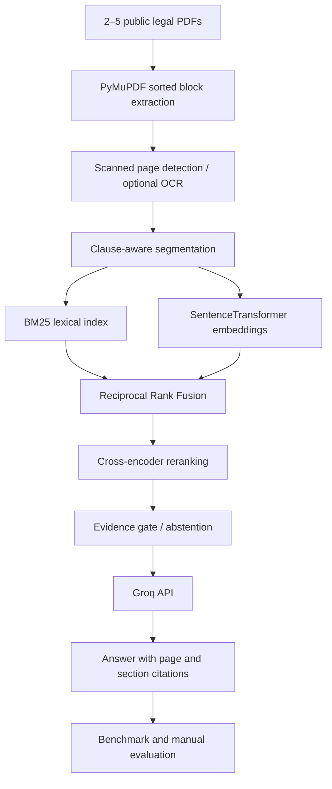

# Architecture

```mermaid
flowchart TD
 A[2–5 public legal PDFs] --> B[PyMuPDF sorted block extraction]
 B --> C[Scanned page detection / optional OCR]
 C --> D[Clause-aware segmentation]
 D --> E[BM25 lexical index]
 D --> F[SentenceTransformer embeddings]
 E --> G[Reciprocal Rank Fusion]
 F --> G
 G --> H[Cross-encoder reranking]
 H --> I[Evidence gate / abstention]
 I --> J[Groq API]
 J --> K[Answer with page and section citations]
 K --> L[Benchmark and manual evaluation]
```
